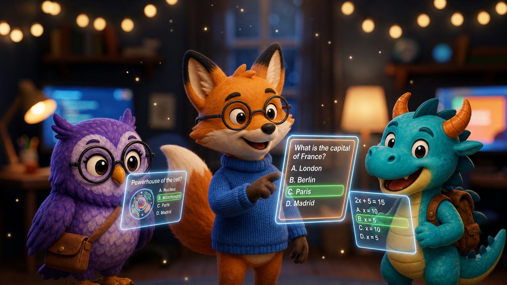
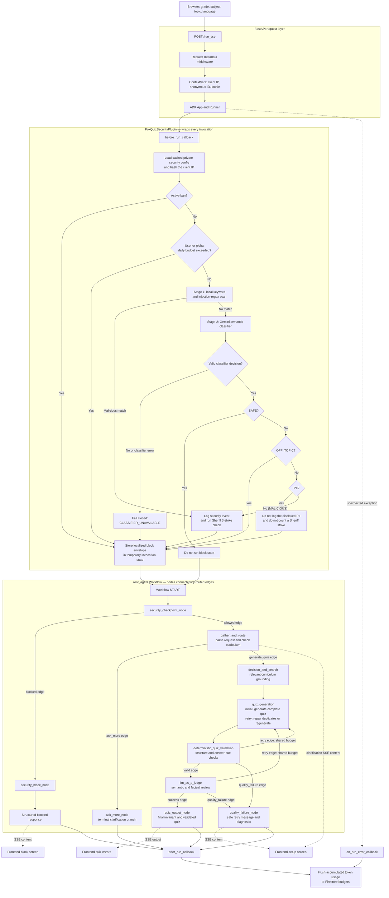

# 🦊 FoxQuiz: Dynamic Interactive Exam Prep Companion



🌐 **Play Online Now:** [https://foxquiz.app](https://foxquiz.app)

> Built by **Leonardo Muffato** at **AUTOSOFT Engineering** ([www.autosoft-engineering.de](https://www.autosoft-engineering.de))  
> Licensed under **Creative Commons Attribution 4.0 International (CC BY 4.0)** with upstream preservation of Google LLC's Apache 2.0 components.

---

## 🎯 Project Overview
FoxQuiz is an intelligent, highly engaging, and child-safe exam preparation application designed to help kids in Grades 5–12 master academic topics in a playful and localized environment. Powered by **Google ADK 2.0** and **Gemini 2.5 Flash**, FoxQuiz features dynamic mascot pedagogy (Felix the Fox, Olivia the Owl, Dino the Dragon), smart curriculum checks, academic peer-review nodes, and state-of-the-art security guardrails to keep students safe.

## 🎥 Project Walkthrough & Demo

Discover why we built FoxQuiz, see a full feature demo, and explore the technical deep-dive:

📺 **Watch the Presentation on YouTube:** [FoxQuiz Explainer Video](https://youtu.be/5zt7EqS9uvg)


## Project Structure

```
foxquiz/
├── app/                       # Agent, API, persistence, and web frontend
│   ├── agent.py               # Main agent logic
│   └── app_utils/             # App utilities and helpers
├── tests/
│   ├── unit/                  # Deterministic Python unit tests
│   ├── integration/           # Server tests and local-only Google agent tests
│   ├── browser/               # Credential-free Playwright user-flow tests
│   └── eval/                  # LLM behavioral evaluation datasets and rubrics
├── AGENTS.md                  # AI-assisted development guide
└── pyproject.toml             # Project dependencies
```

> 💡 **Tip:** Use [agents-cli](https://github.com/google/agents-cli) for AI-assisted development - project context is pre-configured in `AGENTS.md`.

## Requirements

Before you begin, ensure you have:
- **uv**: Python package manager (used for all dependency management in this project) - [Install](https://docs.astral.sh/uv/getting-started/installation/) ([add packages](https://docs.astral.sh/uv/concepts/dependencies/) with `uv add <package>`)
- **agents-cli**: Agents CLI - Install with `uv tool install google-agents-cli`  
  > ⚠️ **Platform Note:** The `agents-cli` tool currently only runs on **Linux** or inside **WSL (Windows Subsystem for Linux)** on Windows. Ensure your development terminal is running in a Linux/WSL environment before executing CLI commands.
- **Google Cloud SDK**: For GCP services - [Install](https://cloud.google.com/sdk/docs/install)


## Quick Start

Install `agents-cli` and its skills if not already installed:

```bash
uvx google-agents-cli setup
```

Install required packages:

```bash
agents-cli install
```

Test the agent with a local web server:

```bash
agents-cli playground
```

You can also use features from the [ADK](https://adk.dev/) CLI with `uv run adk`.

## 🖥️ Running and Restarting the Application

### 1. How to Start the Application
To launch the FoxQuiz local playground or start the web server, you can use either the standardized agent CLI or start the FastAPI application directly:

* **Option A (Standard Agent CLI):**
  ```bash
  agents-cli playground
  ```
* **Option B (Direct FastAPI/Uvicorn Command):**
  ```bash
  uv run uvicorn app.fast_api_app:app --reload --host 127.0.0.1 --port 8000
  ```

Once started, open your browser and navigate to `http://127.0.0.1:8000` to interact with FoxQuiz!

### 🔄 How to Restart the Application (Fresh Session & Logs)
If you need to clear your active session or reset the server output to get a fresh console log, follow these steps:

1. **Terminate the running server process on port 8000:**
   * On **Linux / WSL** (instant port cleanup):
     ```bash
     kill $(lsof -t -i:8000)
     ```
     *(Alternative: `fuser -k 8000/tcp`)*
   * **Manual Process Lookup**:
     ```bash
     ps aux | grep -E "uvicorn|fast_api_app"
     kill <PID>
     ```

2. **Boot up a fresh server session:**
   Simply run the start command again:
   ```bash
   agents-cli playground
   # OR
   uv run uvicorn app.fast_api_app:app --reload --host 127.0.0.1 --port 8000
   ```

## Commands

| Command | Description |
| ------- | ----------- |
| `agents-cli install` | Install dependencies using uv |
| `agents-cli playground` | Launch the local development environment |
| `agents-cli lint` | Run code quality checks |
| `agents-cli eval` | Evaluate agent behavior (generate, grade, analyze, and more — see `agents-cli eval --help`) |
| `uv run playwright install chromium` | Install Chromium once for local frontend tests |
| `uv run pytest tests/unit tests/integration tests/browser -m "not google_cloud"` | Run the credential-free suite used by GitHub Actions |
| `uv run pytest tests/integration -m google_cloud` | Run real-agent integration tests locally with Google credentials |

## 🛠️ Project Management

| Command | What It Does |
|---------|--------------|
| `agents-cli scaffold enhance` | Add CI/CD pipelines and Terraform infrastructure |
| `agents-cli infra cicd` | One-command setup of entire CI/CD pipeline + infrastructure |
| `agents-cli scaffold upgrade` | Auto-upgrade to latest version while preserving customizations |

## 🏛️ High Concurrency & Scalability Architecture

FoxQuiz is designed from the ground up to support high-concurrency, multi-user parallel access. The technology stack scales seamlessly to accommodate thousands of simultaneous students:

### 1. Client-Side Presentation Independence
* **State Isolation:** Each user runs their own copy of the Single-Page Application (HTML/CSS/JS) entirely within their web browser. All quiz logic, timers, animations, and mascot states run locally on the client machine, resulting in zero crossover or resource contention between parallel visitors.

### 2. Async FastAPI & Session Isolation
* **Non-Blocking Async IO:** The backend is powered by **FastAPI** running on **Uvicorn**, which handles incoming HTTP requests asynchronously.
* **Isolated Sessions:** Under ADK 2.0, each user session is assigned a unique anonymous `session_id` and `user_id` (generated as UUIDs in the browser). The agent orchestrator runs separate, fully isolated instances of the quiz-generation workflow graph for each session, preventing data cross-talk.

### 3. Serverless Cloud Database (Google Cloud Firestore)
The persistence layer relies on **Cloud Firestore (Native Mode)**, Google's serverless document store built for global-scale concurrency:
* **Elastic Scaling:** Unlike traditional relational databases (which hit connection pool limits), Firestore scales automatically to handle tens of thousands of simultaneous reads and writes.
* **Atomic Satisfaction Counters (No Race Conditions):** For the **aggregated thumbs-up counter**, Firestore's native **atomic increments** are used. If 100 users complete a quiz and click "Thumbs-Up" at the exact same millisecond, Firestore guarantees they are all counted accurately without transaction deadlocks or lost updates.
* **Independent Documents:** Writing thumbs-down review logs and saving frozen quizzes create unique documents using random UUIDs, allowing parallel creations to execute at maximum cloud speed.

## 🔗 Zero-Token Frozen Quiz Sharing

FoxQuiz includes an interactive social feature that allows students to freeze and share their generated quizzes with friends, parents, or teachers:

* **Instant Recipient Delivery:** When a user clicks **"Share"**, the frontend "freezes" the active 10-question quiz state and saves it as a static document in Google Cloud Firestore under `quizzes/{quiz_id}`.
* **Zero-Token Cost:** When a recipient visits the generated share link, our FastAPI backend (`/quiz/{quiz_id}`) serves the static SPA layout and directly loads the frozen JSON data. **No LLM model calls are triggered and zero Vertex AI tokens are consumed**, making sharing instant and infinitely scalable.
* **30-Day Link Expiration:** To limit cloud storage overhead and maintain strict compliance with GDPR/LGPD data-minimization guidelines for minors, every shared quiz is written with an `expires_at` timestamp. Shared links stop working **30 days after creation**, and Firestore's native Time To Live (TTL) policy automatically deletes the corresponding quiz documents.
* **Local Offline Export:** Students can also click **"Save as HTML"** to download the complete quiz locally as a beautifully-styled, standalone HTML file that works offline without any cloud dependencies.

---

## 🛡️ Security Checkpoint & Public Repository Readiness

To allow FoxQuiz to be safely published as a **public GitHub repository** without exposing sensitive defensive rules or safety system instructions, it implements a dynamic, serverless configuration system:

* **Dynamic Configurations:** Prompt injection keywords, administrative command regexes, defensive classification prompts, and localized block responses are stored privately in Google Cloud Firestore under the `system_config/security` document.
* **No Code Exposure:** Defensive regexes and system-level instructions are never committed to git, preventing attackers from reverse-engineering guardrail vulnerabilities.
* **Multi-Stage Interception:** The `FoxQuizSecurityPlugin.before_run_callback` intercepts every invocation before the workflow starts. It conducts rapid keyword and regex matching, intercepts administrative command overrides (such as requests to delete logs or modify system configurations), and runs an LLM classifier using the private prompt configuration. The classifier also recognizes disclosed personal data semantically across languages, countries, and document types instead of relying on an incomplete fixed identifier list.
* **Clean Workflow Blocks:** Expected security, privacy, off-topic, and budget blocks are routed to a terminal workflow response. The frontend receives a structured block envelope and shows the localized message instead of a generic application error.
* **Logged Security Events:** Malicious injection attempts or administrative bypass commands are blocked immediately and logged securely to a private `security_events` Firestore collection for auditing.


### How a Quiz Request Travels Through FoxQuiz

The diagram separates the surrounding **FastAPI request handling**, the
invocation-wide **ADK plugin**, and the graph-based **Workflow**. A plugin wraps
the whole invocation; it is not a workflow node. Nodes perform work, while
edges connect nodes and may select a route emitted by the preceding node.



#### Duplicate-option repair and academic review

The duplicate-option repair is an internal branch of `quiz_generation`, not a
separate ADK workflow node. Initial generation must create the complete quiz:
ten questions, 30–50 answer options, explanations, correct indices, curriculum
alignment, difficulty, language, and tone. Even with an explicit uniqueness
instruction, that larger generative task can occasionally produce equivalent
options. An unvalidated candidate is never sent to the learner.

`deterministic_quiz_validation` first checks objective invariants, including
question and option counts, normalized duplicate options, valid index ranges,
empty content, emojis, and visual correctness cues. When every reported issue
is a duplicate option and the shared retry budget remains, the retry edge
returns to `quiz_generation`, which selects its targeted repair branch. That
branch receives only the affected questions and returns a small structured
response containing replacement option lists and their corrected
`correct_option_index` values. It cannot rewrite the title, question text,
explanations, or unaffected questions because those fields are absent from the
repair response schema. The repair also uses a lower generation temperature
than full quiz generation to reduce unnecessary variation.

The repaired candidate is not trusted automatically. It passes through
`deterministic_quiz_validation` again. A malformed or incomplete repair is
blocked when the retry budget is exhausted. If the first candidate contains
mixed or non-duplicate defects, FoxQuiz uses the existing full-regeneration
branch instead because changing options alone cannot safely correct those
problems.

After deterministic validation succeeds, `llm_as_a_judge` still performs the
semantic and academic review. The Judge checks factual correctness, curriculum
and grade alignment, requested difficulty, and whether each
`correct_option_index` points to the genuinely correct answer described by the
explanation. A successful repair therefore follows this sequence:

```text
full quiz generation
  -> deterministic validation
  -> targeted duplicate-option repair
  -> deterministic validation again
  -> LLM-as-a-Judge
  -> final invariant check and learner output, or fail closed
```

The existing reinforcement-mode exception is unchanged: when
`previous_score <= 3`, FoxQuiz reuses previously validated questions and skips
the academic Judge. All other repaired candidates must pass the Judge before
release.

The similarly named decisions and routes have different responsibilities:

| Term | Layer | Meaning |
| --- | --- | --- |
| `SAFE` | Gemini security classifier | Continue without creating block state. |
| `OFF_TOPIC` | Gemini security classifier | Stop with a friendly school-topic message; do not record a malicious violation. |
| `PII` | Gemini security classifier | Stop with a privacy message; do not write the disclosed input to `security_events` and do not issue a Sheriff strike. |
| `MALICIOUS` | Local scan or Gemini classifier | Log a security event, evaluate the Sheriff rule, and block the invocation. |
| `allowed` | Edge from `security_checkpoint_node` | No block envelope exists, so normal quiz processing may begin. |
| `BANNED` / `BUDGET_EXCEEDED` / `CLASSIFIER_UNAVAILABLE` | Plugin block types, not classifier decisions | Stop before quiz processing because an operational guard rejected the invocation. |
| `blocked` | Edge from `security_checkpoint_node` | A block envelope exists, so the graph goes directly to `security_block_node`. |
| `generate_quiz` / `ask_more` | Edges from `gather_and_route` | The curriculum check either starts quiz preparation or requests clarification. |
| `valid` / `retry` / `quality_failure` | Edges from `deterministic_quiz_validation` | Continue to semantic review, return to `quiz_generation` for targeted duplicate repair or full regeneration within the shared budget, or fail closed on objective defects. |
| Duplicate-option repair | Internal retry branch of `quiz_generation` | Replace only affected option lists and indices, preserve all other quiz content, then return the candidate to deterministic validation. |
| `retry` / `success` / `quality_failure` | Edges from `llm_as_a_judge` | Regenerate within the shared budget, publish the validated quiz, or fail closed without exposing an unvalidated quiz. |

> **Why the extra security node?** The plugin performs cross-cutting checks before
> the graph runs and records an expected block in invocation-local state. The
> first workflow node converts that state into an explicit `allowed` or
> `blocked` graph route. This prevents an expected safety decision from becoming
> an application error and guarantees that blocked input never reaches quiz
> generation.
> The custom FastAPI `SecurityBlockException` handler is a fallback for a
> security exception that reaches the HTTP layer. The normal `/run_sse` path
> catches expected blocks inside the plugin and routes them through temporary
> state as shown above.


### 🤠 Automated Sheriff Guard (Zero-Token Auto-Banning)
To prevent malicious actors or automated bots from draining our Vertex AI token budget via repeated safety violations, we implement an automated defense subsystem code-named **The Sheriff Guard**:
1. **Secure Client Fingerprinting:** For every request, we extract the client's IP address and generate a one-way secure hash (`hashed_ip = SHA-256(IP + salt)`) with a secret salt stored in Firestore. Because raw IP addresses are personal data under GDPR/LGPD, this fingerprinter provides zero-PII security for minors while uniquely identifying repeat spammers.
2. **Zero-Token Fast Block:** Incoming requests are matched against a fast, local in-memory active ban cache. An active Firestore ban seeds that cache for up to 24 hours. If a banned signature matches, the request is instantly short-circuited at the entry gate, consuming **exactly 0 LLM tokens** and protecting the system budget.
3. **The Gavel (3-Strike Trigger):** If a user commits a safety violation, it is logged to `security_events` under their hashed signature. The Sheriff checks their recent logs: if a signature accumulates **3 or more safety violations** within any 1-hour window, they are automatically banned for 24 hours. The ban is written to the Firestore `banned_signatures` collection and instantly updated in the local active ban cache.

> 💡 **Note:** `OFF_TOPIC` requests and inputs classified as `PII` are intercepted with a friendly response, but they are **not** treated as malicious safety violations. PII input is not written to `security_events`. Only security exploits, prompt injections, or administrative override attempts are logged there and count towards a Sheriff ban.

---

## Development

Edit your agent logic in `app/agent.py` and test with `agents-cli playground` - it auto-reloads on save.

### Testing

FoxQuiz uses unit, server integration, Playwright browser, and LLM behavioral
tests. GitHub Actions runs only credential-free tests; tests that invoke Google
services must be run locally. See [`CONTRIBUTING.md`](CONTRIBUTING.md) for the
test boundaries, setup, and commands.

## Deployment

```bash
gcloud config set project <your-project-id>
agents-cli deploy
```

### A2A access

The agents-cli 1.3.1 A2A implementation is installed but disabled by default.
The agent card and JSON-RPC endpoint under `/a2a/app` return HTTP 404 unless
`ENABLE_A2A` is set exactly to `TRUE` when the service starts.

The `create_params.is_a2a` field in `agents-cli-manifest.yaml` is primarily a
metadata switch for agents-cli. It tells CLI operations such as `publish`
whether the project should be treated as exposing an A2A interface and whether
the A2A Agent Card registration path should be used for the Google Enterprise
ecosystem. It does not mount or unmount the HTTP routes by itself.

To operate FoxQuiz over A2A again, first set the manifest field to
`is_a2a: true`, then set the runtime environment variable `ENABLE_A2A=TRUE` and
restart or redeploy the service. Both settings should agree so agents-cli
metadata and the actual serving surface describe the same operating state.

To enable A2A locally:

```bash
ENABLE_A2A=TRUE uv run uvicorn app.fast_api_app:app --host 127.0.0.1 --port 8000
```

Remove the variable or set it to `FALSE`, then restart the service, to disable
A2A again. A deployed Cloud Run service requires a new revision or environment
variable update before this setting changes; changing the repository alone does
not modify the running service.

To add CI/CD and Terraform, run `agents-cli scaffold enhance`.
To set up your production infrastructure, run `agents-cli infra cicd`.

## Observability

Built-in telemetry exports to Cloud Trace, BigQuery, and Cloud Logging.

---

## License

FoxQuiz uses a clear mixed-license model:

- Software, tests, build scripts, configuration, and infrastructure definitions:
  [Apache License 2.0](LICENSES/Apache-2.0.txt)
- Documentation and specifications:
  [Creative Commons Attribution 4.0](LICENSES/CC-BY-4.0.txt)
- Original mascot artwork and the derivatives explicitly listed in the artwork
  provenance notice: [CC0 1.0 Universal](LICENSES/CC0-1.0.txt)

See the top-level [`LICENSE`](LICENSE) file for the authoritative scope and
third-party attribution rules. Individual file notices take precedence.

---

## Mascot Artwork License

The original Felix, Olivia, and Dino artwork, favicon/mobile icons, and social
preview derivatives are dedicated to the public domain under
[CC0 1.0 Universal](https://creativecommons.org/publicdomain/zero/1.0/), to the
extent that applicable rights exist and can be waived. The artwork is
AI-assisted and includes a detailed human-contribution and generation
provenance notice in
[`assets/brand_sources/README.md`](assets/brand_sources/README.md).

---

## 💖 Acknowledgments & Recognition
This project was developed as a capstone project for [**Kaggle’s 5-Day AI Agents: Intensive Vibe Coding Course with Google**](https://www.kaggle.com/competitions/5-day-ai-agents-intensive-vibecoding-course-with-google) and is directly inspired by the concepts, techniques and best practices taught throughout the course.

We would like to express our deepest gratitude to the entire **Kaggle and Google team** for providing this extraordinary learning opportunity, which equipped us with the cutting-edge [**Google Agent Development Kit (ADK) 2.0**](https://adk.dev/2.0/) framework, the powerful [**agents-cli**](https://github.com/google/agents-cli) developer workflows, and the [**Antigravity CLI**](https://antigravity.google/product/antigravity-cli) coding companion, alongside the advanced evaluation pipelines and agentic methodologies necessary to bring this project to life!

---

## 💖 Support the Project & Keep Education Free!

FoxQuiz is a **100% free, open-source, and ad-free** educational initiative built to empower children globally with high-quality, safe, and personalized exam preparation. 

To keep this platform freely accessible to students and schools everywhere, we rely on community contributions to cover active LLM API costs. **100% of all financial donations are used directly to fund Google Gemini API educational tokens for kids using FoxQuiz.**

*   **Support us directly via PayPal:** [PayPal.me/Muffato](https://paypal.me/Muffato)
*   **Sponsor us on GitHub:** Click the **Sponsor** heart button at the top of our repository!

*Every token counts. Thank you for empowering the next generation of students!* 🎓🦊✨
