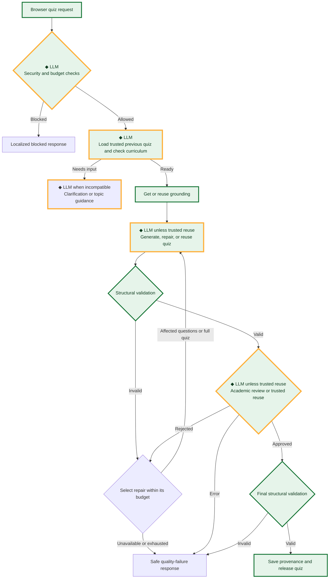
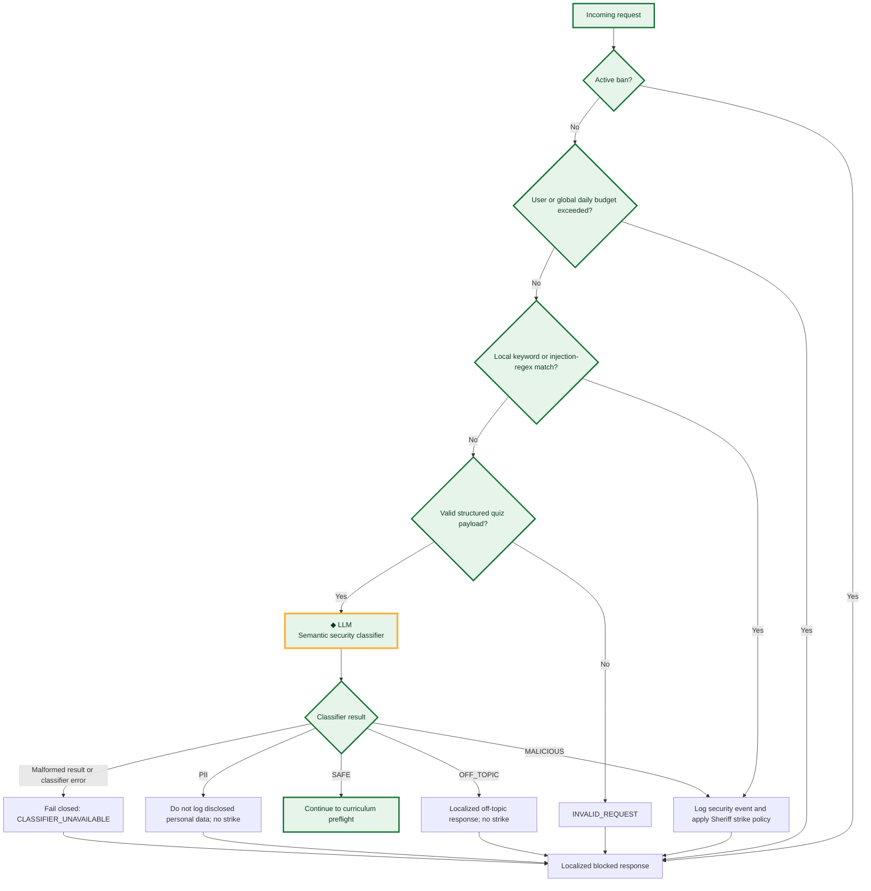
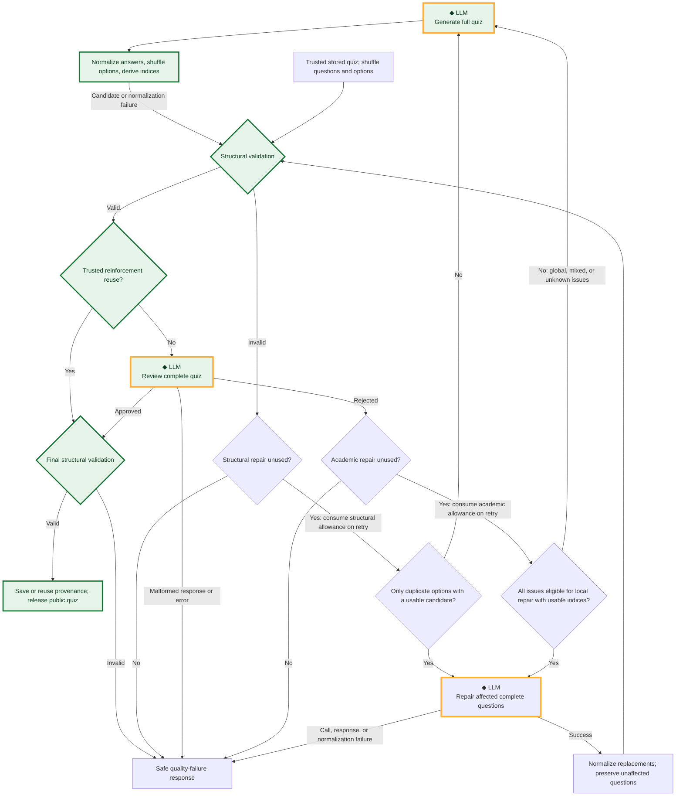
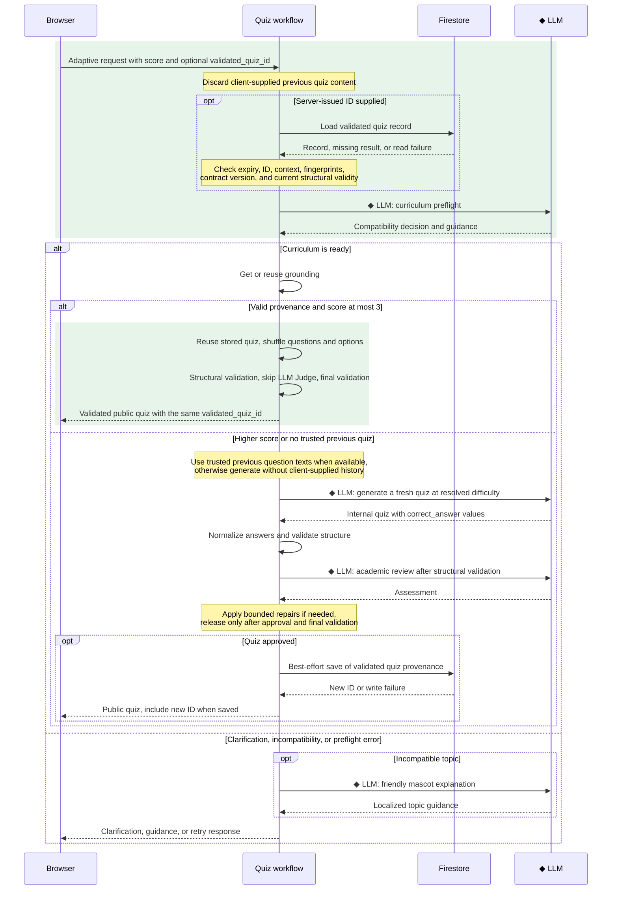

# 🦊 FoxQuiz: Dynamic Interactive Exam Prep Companion


🌐 **Play Online Now:** [https://foxquiz.app](https://foxquiz.app)

> Built by **Leonardo Muffato** at **AUTOSOFT Engineering** ([www.autosoft-engineering.de](https://www.autosoft-engineering.de))  
> Licensed under **Creative Commons Attribution 4.0 International (CC BY 4.0)** with upstream preservation of Google LLC's Apache 2.0 components.

---

## 🎯 Project Overview
FoxQuiz is an intelligent, highly engaging, and child-safe exam preparation application designed to help kids in Grades 1–12 (approximately ages 6–18) master academic topics in a playful and localized environment. Powered by **Google ADK 2.0** and `gemini-2.5-flash`, FoxQuiz features dynamic mascot pedagogy (Felix the Fox, Olivia the Owl, Dino the Dragon), smart curriculum checks, academic peer-review nodes, and state-of-the-art security guardrails to keep students safe. For younger children, the first release is designed for shared use with a parent or teacher, while every generated quiz remains age-appropriate for the selected grade.

## 🎥 Project Walkthrough & Demo

Discover why we built FoxQuiz, see a full feature demo, and explore the technical deep-dive:

📺 **Watch the Presentation on YouTube:** [FoxQuiz Explainer Video](https://youtu.be/5zt7EqS9uvg)

---

## 🎓 Age-Appropriate Pedagogy & Grade Policies (Grades 1–12)

FoxQuiz adapts its question structure, language complexity, and cognitive requirements to match the developmental stage of learners from early primary through secondary school:

| Grade Level | Pedagogical Stage | Option Count | Explanation Length | Negative Questions (*"Which is NOT..."*) | Question Text / Option Emojis | Pedagogical Focus |
| :--- | :--- | :--- | :--- | :--- | :--- | :--- |
| **Grades 1–2** | `PRIMARY_EARLY` (Ages 6–8) | **Exactly 3** | Max 2 short sentences | ❌ **Strictly Forbidden** | ❌ **Forbidden in questions/options** | Concrete everyday vocabulary, beginner-reader friendly |
| **Grades 3–4** | `PRIMARY_LATE` (Ages 8–10) | 3 to 5 | Max 3 short sentences | ❌ **Forbidden** | ❌ **Forbidden in questions/options** | Basic academic concepts, simple cause-and-effect |
| **Grades 5–8** | `SECONDARY_LOWER` (Ages 10–14) | 3 to 5 | Standard (detailed) | ✅ Allowed | ❌ **Forbidden in questions/options** | Domain-specific terminology, logical relations |
| **Grades 9–12** | `SECONDARY_UPPER` (Ages 14–18) | 3 to 5 | Comprehensive academic | ✅ Allowed | ❌ **Forbidden in questions/options** | Abstract analytical reasoning, high-school exam rigor |

### Key Pedagogical Principles for Primary Grades (1–4):
1. **Cognitive Load & Reading Accessibility (3 Options for Grades 1–2):** Presenting 4–5 choices overwhelms early readers. Exactly 3 choices provides the optimal balance between guessing probability and reading effort.
2. **Negation Avoidance:** Young children struggle with double negation and inverted logic (*"Which animal does NOT have fur?"*). FoxQuiz strictly bans negative questions in Grades 1–4 to prevent unintended confusion.
3. **Bite-Sized Explanations:** Explanations for early grades are limited to 1–2 encouraging, easily digestible sentences.
4. **Answer-Safe Presentation Emojis:** Friendly emojis may appear in the title, explanation, or difficulty presentation, but deterministic validation keeps question text and answer options emoji-free and rejects visual answer cues.

---


## Project Structure

```
foxquiz/
├── app/                       # Agent, API, persistence, and web frontend
│   ├── agent.py               # Main agent logic
│   └── app_utils/             # App utilities and helpers
├── tests/
│   ├── unit/                  # Deterministic Python unit tests
│   ├── integration/           # Server tests and local-only Google agent tests
│   ├── browser/               # Credential-free Playwright user-flow tests
│   └── eval/                  # LLM behavioral evaluation datasets and rubrics
├── AGENTS.md                  # AI-assisted development guide
└── pyproject.toml             # Project dependencies
```

> 💡 **Tip:** Use [agents-cli](https://github.com/google/agents-cli) for AI-assisted development - project context is pre-configured in `AGENTS.md`.

## Requirements

Before you begin, ensure you have:
- **uv**: Python package manager (used for all dependency management in this project) - [Install](https://docs.astral.sh/uv/getting-started/installation/) ([add packages](https://docs.astral.sh/uv/concepts/dependencies/) with `uv add <package>`)
- **agents-cli**: Agents CLI - Install with `uv tool install google-agents-cli`  
  > ⚠️ **Platform Note:** The `agents-cli` tool currently only runs on **Linux** or inside **WSL (Windows Subsystem for Linux)** on Windows. Ensure your development terminal is running in a Linux/WSL environment before executing CLI commands.
- **Google Cloud SDK**: For GCP services - [Install](https://cloud.google.com/sdk/docs/install)


## Quick Start

Install `agents-cli` and its skills if not already installed:

```bash
uvx google-agents-cli setup
```

Install required packages:

```bash
agents-cli install
```

Test the agent with a local web server:

```bash
agents-cli playground
```

FoxQuiz accepts the same structured JSON request in the ADK playground and
from direct API clients that its browser sends automatically. See
[Structured quiz request contract](#structured-quiz-request-contract) for an
example. Free-form chat prompts are intentionally unsupported.

You can also use features from the [ADK](https://adk.dev/) CLI with `uv run adk`.

## 🖥️ Running and Restarting the Application

### 1. How to Start the Application
To launch the FoxQuiz local playground or start the web server, you can use either the standardized agent CLI or start the FastAPI application directly:

* **Option A (Standard Agent CLI):**
  ```bash
  agents-cli playground
  ```
* **Option B (Direct FastAPI/Uvicorn Command):**
  ```bash
  uv run uvicorn app.fast_api_app:app --reload --host 127.0.0.1 --port 8000
  ```

Once started, open your browser and navigate to `http://127.0.0.1:8000` to interact with FoxQuiz!

### 🔄 How to Restart the Application (Fresh Session & Logs)
If you need to clear your active session or reset the server output to get a fresh console log, follow these steps:

1. **Terminate the running server process on port 8000:**
   * On **Linux / WSL** (instant port cleanup):
     ```bash
     kill $(lsof -t -i:8000)
     ```
     *(Alternative: `fuser -k 8000/tcp`)*
   * **Manual Process Lookup**:
     ```bash
     ps aux | grep -E "uvicorn|fast_api_app"
     kill <PID>
     ```

2. **Boot up a fresh server session:**
   Simply run the start command again:
   ```bash
   agents-cli playground
   # OR
   uv run uvicorn app.fast_api_app:app --reload --host 127.0.0.1 --port 8000
   ```

## Commands

| Command | Description |
| ------- | ----------- |
| `agents-cli install` | Install dependencies using uv |
| `agents-cli playground` | Launch the local development environment |
| `agents-cli lint` | Run code quality checks |
| `agents-cli eval` | Evaluate agent behavior (generate, grade, analyze, and more — see `agents-cli eval --help`) |
| `uv run playwright install chromium` | Install Chromium once for local frontend tests |
| `uv run pytest tests/unit tests/integration tests/browser -m "not google_cloud"` | Run the credential-free suite used by GitHub Actions |
| `uv run pytest tests/integration -m google_cloud` | Run real-agent integration tests locally with Google credentials |

## 🛠️ Project Management

| Command | What It Does |
|---------|--------------|
| `agents-cli scaffold enhance` | Add CI/CD pipelines and Terraform infrastructure |
| `agents-cli infra cicd` | One-command setup of entire CI/CD pipeline + infrastructure |
| `agents-cli scaffold upgrade` | Auto-upgrade to latest version while preserving customizations |

## 🏛️ High Concurrency & Scalability Architecture

FoxQuiz is designed from the ground up to support high-concurrency, multi-user parallel access. The technology stack scales seamlessly to accommodate thousands of simultaneous students:

### 1. Client-Side Presentation Independence
* **State Isolation:** Each user runs their own copy of the Single-Page Application (HTML/CSS/JS) entirely within their web browser. All quiz logic, timers, animations, and mascot states run locally on the client machine, resulting in zero crossover or resource contention between parallel visitors.

### 2. Async FastAPI & Session Isolation
* **Non-Blocking Async IO:** The backend is powered by **FastAPI** running on **Uvicorn**, which handles incoming HTTP requests asynchronously.
* **Isolated Sessions:** Under ADK 2.0, each user session is assigned a unique anonymous `session_id` and `user_id` (generated as UUIDs in the browser). The agent orchestrator runs separate, fully isolated instances of the quiz-generation workflow graph for each session, preventing data cross-talk.

### 3. Serverless Cloud Database (Google Cloud Firestore)
The persistence layer relies on **Cloud Firestore (Native Mode)**, Google's serverless document store built for global-scale concurrency:
* **Elastic Scaling:** Unlike traditional relational databases (which hit connection pool limits), Firestore scales automatically to handle tens of thousands of simultaneous reads and writes.
* **Atomic Satisfaction Counters (No Race Conditions):** For the **aggregated thumbs-up counter**, Firestore's native **atomic increments** are used. If 100 users complete a quiz and click "Thumbs-Up" at the exact same millisecond, Firestore guarantees they are all counted accurately without transaction deadlocks or lost updates.
* **Independent Documents:** Writing thumbs-down review logs and saving frozen quizzes create unique documents using random UUIDs, allowing parallel creations to execute at maximum cloud speed.

Quiz content is stored in two collections with different triggers and purposes:

| Collection | Created when | Purpose | Retention | Shareable |
| --- | --- | --- | --- | --- |
| `quizzes` | A user clicks **Share** | Serve a frozen quiz through its share link without another model call | 30 days | Yes, through its unguessable link |
| `validated_quizzes` | A newly generated quiz passes deterministic validation and academic review | Provide trusted, server-side provenance for adaptive follow-ups, including safe reinforcement reuse and duplicate-prevention context | 1 day | No; it is an internal workflow record |

Validated-quiz provenance contains the normalized public quiz and context-bound
fingerprints, but no user IDs, session IDs, raw prompts, or rejected candidates.
The write is best effort: if it fails, the quiz is still delivered, while later
adaptive requests fall back to ordinary generation and academic review.

## 🔗 Zero-Token Frozen Quiz Sharing

FoxQuiz includes an interactive social feature that allows students to freeze and share their generated quizzes with friends, parents, or teachers:

* **Instant Recipient Delivery:** When a user clicks **"Share"**, the frontend "freezes" the active 10-question quiz state and saves it as a static document in Google Cloud Firestore under `quizzes/{quiz_id}`.
* **Zero-Token Cost:** When a recipient visits the generated share link, our FastAPI backend (`/quiz/{quiz_id}`) serves the static SPA layout and directly loads the frozen JSON data. **No LLM model calls are triggered and zero Vertex AI tokens are consumed**, making sharing instant and infinitely scalable.
* **30-Day Link Expiration:** To limit cloud storage overhead and maintain strict compliance with GDPR/LGPD data-minimization guidelines for minors, every shared quiz is written with an `expires_at` timestamp. Shared links stop working **30 days after creation**, and Firestore's native Time To Live (TTL) policy automatically deletes the corresponding quiz documents.
* **Local Offline Export:** Students can also click **"Save as HTML"** to download the complete quiz locally as a beautifully-styled, standalone HTML file that works offline without any cloud dependencies.

---

## 🛡️ Security Checkpoint & Public Repository Readiness

To allow FoxQuiz to be safely published as a **public GitHub repository** without exposing sensitive defensive rules or safety system instructions, it implements a dynamic, serverless configuration system:

* **Dynamic Configurations:** Prompt injection keywords, administrative command regexes, defensive classification prompts, and localized block responses are stored privately in Google Cloud Firestore under the `system_config/security` document.
* **No Code Exposure:** Defensive regexes and system-level instructions are never committed to git, preventing attackers from reverse-engineering guardrail vulnerabilities.
* **Multi-Stage Interception:** The `FoxQuizSecurityPlugin.before_run_callback` intercepts every invocation before the workflow starts. It conducts rapid keyword and regex matching, intercepts administrative command overrides (such as requests to delete logs or modify system configurations), validates the structured quiz request, and runs an LLM classifier using the private prompt configuration. The classifier also recognizes disclosed personal data semantically across languages, countries, and document types instead of relying on an incomplete fixed identifier list.
* **Clean Workflow Blocks:** Expected security, privacy, off-topic, and budget blocks are routed to a terminal workflow response. The frontend receives a structured block envelope and shows the localized message instead of a generic application error.
* **Logged Security Events:** Malicious injection attempts or administrative bypass commands are blocked immediately and logged securely to a private `security_events` Firestore collection for auditing.


### How a Quiz Request Travels Through FoxQuiz

The main workflow below groups internal security and repair decisions into
stages. See the [detailed workflow](docs/development/quiz-workflow.md) for
security checks, provenance verification, and runtime integration details.



**Legend:** Green blocks show the default successful path for a new quiz,
without clarification or retries. **◆ LLM** and an orange border mark stages
that can call a language model. Early security blocks use no LLM; trusted
reinforcement skips generation and academic-review calls. Clarification uses
the curriculum result; an incompatible topic triggers an additional mascot
LLM call. Retry paths can revisit green blocks.

Structural and academic repairs retain separate allowances of one each.
Both local repair sources use the same executor; full regeneration handles
issues that cannot be addressed locally. Every repaired quiz returns through
structural validation and academic review. Trusted reinforcement reuses an
already approved server quiz and skips the LLM Judge after structural checks.
A failed final validation also returns a safe quality-failure response.

#### Focused workflow diagrams

Expand a diagram to inspect one part of the workflow. The flowcharts use the
same green successful path and orange **◆ LLM** markers as the overview.
The sequence diagram highlights successful trusted reinforcement in green
and labels model calls explicitly.

<details>
<summary><strong>Security screening</strong></summary>

Green follows an allowed, valid request. Local checks run before the semantic
classifier, so bans, exhausted budgets, known attacks, and malformed payloads
can be blocked without a model call.



The privacy branch describes a semantic classifier result. A request caught
by the earlier local malicious-pattern scan follows the security-event path.
Infrastructure errors also prevent an unchecked request from proceeding.

</details>

<details>
<summary><strong>Validation and repair</strong></summary>

Green follows a newly generated quiz accepted on its first attempt. Both
repair sources share a targeted executor, but consume independent allowances:
one structural repair and one academic repair per invocation.



A repaired quiz passes through both validation layers again. Repair selection
is deterministic; the model performs generation or correction, not routing.
Normalization removes the internal `correct_answer` field before a candidate
can become public output.

</details>

<details>
<summary><strong>Adaptive quiz reuse</strong></summary>

Green highlights successful trusted reinforcement: a student with a score
of 3/10 or below repeats a server-validated quiz. **◆ LLM** labels identify
model calls; sequence diagrams use message labels instead of flowchart borders.
Security screening must pass before the provenance lookup shown below.



Missing, expired, incompatible, or unavailable provenance falls back to normal
generation and academic review. For low scores, that fallback creates a new
Easy quiz. A provenance write failure does not block an approved quiz, but
prevents trusted reuse of that result on the next request. Failed validation
follows the bounded repair and failure paths in the preceding diagram.

</details>

#### Runtime LLM call overview

| Purpose | Diagram location | Model | Temperature | When it runs |
| --- | --- | --- | --- | --- |
| Semantic security classification | Semantic security classifier | `gemini-2.5-flash` | `0.0` | Requests that pass the local scan and structured-payload validation |
| Curriculum compatibility preflight | gather_and_route | `gemini-2.5-flash` | `0.0` | After grade, subject, and topic are known, it checks whether their combination is suitable and sufficiently clear before any quiz is generated |
| Mascot incompatibility response | gather_and_route | `gemini-2.5-flash` | `0.7` | After the curriculum preflight finds an incompatible grade, subject, and topic combination, the mascot explains the issue and suggests suitable alternatives |
| Complete quiz generation | Generate complete quiz | `gemini-2.5-flash` | `0.6` | Initial generation or a non-repair retry |
| Targeted deterministic repair | Duplicate-only repair | `gemini-2.5-flash` | `0.2` | When deterministic validation finds only duplicate options and the repair allowance remains; it regenerates complete affected questions with `correct_answer`, then normalization replaces only those question slots |
| Targeted academic question repair | Targeted repair | `gemini-2.5-flash` | `0.2` | When every Judge issue is local and has valid, non-contradictory 0-based indices; it regenerates complete affected questions and preserves unaffected questions |
| Academic quality review | llm_as_a_judge | `gemini-2.5-flash` | `0.1` | After deterministic validation passes, it reviews facts, answer alignment, grade, curriculum, language, difficulty, emojis, and task variety; it is bypassed only for trusted Firestore-backed reinforcement reuse |

This table is an inventory of possible LLM calls, not a sequence executed for
every request. On the highlighted best-case path, a normal browser request
makes **four LLM calls**: security classification, curriculum compatibility
preflight, complete quiz generation, and academic quality review. Unsupported
free-form or malformed requests are rejected before any LLM call. The mascot
response, targeted repair, and full-generation retry are not used on the
best-case path.

#### Structured quiz request contract

The browser creates this payload automatically. The ADK playground and direct
API clients must submit equivalent JSON text:

```json
{
  "grade": "Grade 8",
  "subject": "Biology",
  "topic": "Cells",
  "preferred_language": "en",
  "mascot_id": "fox"
}
```

`grade`, `subject`, and `topic` are required. `preferred_language` accepts
`de`, `pt`, or `en`; `mascot_id` accepts `fox`, `owl`, or `dragon`. Structured
grade labels from 1 through 12 are normalized to canonical `Klasse N` values;
the contract accepts the labels shown by the German, English, and Portuguese
interfaces. Grades 1–2 always receive exactly three options per question,
whereas Grades 3–12 receive three to five. Structured
clarification and adaptive follow-ups may additionally provide
`clarification_response`, `previous_score`, `previous_questions`,
`previous_quiz_json`, `validated_quiz_id`, and `selected_difficulty`. The
server-issued `validated_quiz_id` is the only trusted provenance for
reinforcement reuse; client-provided `previous_quiz_json` is never sufficient
to bypass generation or the Judge. Unknown fields, missing
required fields, malformed JSON, and free-form text receive a fixed localized
`INVALID_REQUEST` response without parameter-extraction or mascot LLM calls.

#### Answer normalization, repair, and academic review

The quiz-generation node keeps the model's answer representation separate from
the browser contract. Every generated or repaired question contains an
internal `correct_answer` string, never a model-supplied positional index. A
common normalization boundary canonicalizes Unicode and whitespace, requires
exactly one option to match, shuffles options in application code, derives the
public 0-based `correct_option_index`, and removes `correct_answer` before
output. An unvalidated candidate is never sent to the learner.

`deterministic_quiz_validation` checks question and option counts, normalized
duplicate options, index bounds, empty content, emojis, and visual answer
cues. Question text and answer options must be emoji-free; presentation emojis
remain allowed in titles, explanations, and difficulty badges. When every
deterministic issue is a duplicate option, the separate deterministic repair
allowance permits one targeted call that returns complete affected questions.
Normalization then replaces only those question slots and the complete quiz is
validated again. Mixed deterministic issues use full regeneration.

After deterministic validation succeeds, `llm_as_a_judge` performs the
semantic and academic review. Local issues (`factual_error`,
`correct_answer_mismatch`, `negative_question`, `emoji_in_question`, and
`explanation_error`) use targeted repair only when all issues have valid,
non-contradictory 0-based question indices. Quiz-wide issues
(`grade_scope_violation`, `difficulty_mismatch`, `language_mismatch`, and
`task_variety_failure`) use full regeneration. Mixed, unknown, missing, or
invalid indices also use full regeneration; malformed Judge responses and
exceptions fail closed. Task variety is not a rigid four-form requirement when
a narrow topic cannot naturally support that many distinct forms. The academic
budget allows at most one repair after the initial Judge rejection.

The complete generated questions sent to targeted academic repair include the
affected questions, indices, structured issues, grade, subject, topic,
language, curriculum guidance, expected and selected difficulty, previous
score, relevant grounding, and general generation rules. Only unaffected
question texts are included for duplicate prevention. The response must
contain complete questions with `correct_answer`; the assembled quiz is then
normalized, deterministically validated, and judged again.

A successful repair therefore follows this sequence:

```text
full quiz generation (◆ LLM; internal correct_answer)
  -> common normalization and application shuffle
  -> deterministic validation
  -> optional targeted repair for duplicate options (◆ LLM)
  -> normalization and deterministic validation again
  -> LLM-as-a-Judge (◆ LLM)
  -> optional targeted academic repair or full regeneration (◆ LLM)
  -> normalization, complete-quiz validation, and Judge again
  -> final invariant check and learner output, or fail closed
```

#### Randomized option permutation (Zero position bias)

To remove model-driven answer-position bias, generated quizzes pass through
`normalize_generated_quiz`, which delegates each question to
`normalize_generated_question`. Targeted repairs use the same question
normalizer. It matches `correct_answer` to exactly one normalized option,
randomly permutes the options, and deterministically derives the public index.
The model does not supply an index. This randomizes answer positions without
guaranteeing an equal distribution within an individual quiz.

For reinforcement reuse of an already validated public quiz,
`shuffle_quiz_questions` changes question order and `shuffle_quiz_options`
delegates to `shuffle_question_options`. These helpers move the known correct
index with its option using `permutation.index(correct_idx)`.

In reinforcement mode, when `previous_score <= 3`, FoxQuiz may reuse a stored
quiz and skip generation and the academic Judge only after loading a matching,
unexpired Firestore provenance record by the server-issued
`validated_quiz_id`. The stored quiz must pass the current deterministic
validation again. Client-supplied quiz JSON is never authoritative; missing,
expired, incompatible, or invalid provenance falls back to normal generation
and academic review. A successful new quiz writes a short-lived normalized
record to Firestore and returns its ID with the public quiz.

The similarly named decisions and routes have different responsibilities:

| Term | Layer | Meaning |
| --- | --- | --- |
| `SAFE` | Gemini security classifier | Continue without creating block state. |
| `OFF_TOPIC` | Gemini security classifier | Stop with a friendly school-topic message; do not record a malicious violation. |
| `PII` | Gemini security classifier | Stop with a privacy message; do not write the disclosed input to `security_events` and do not issue a Sheriff strike. |
| `MALICIOUS` | Local scan or Gemini classifier | Log a security event, evaluate the Sheriff rule, and block the invocation. |
| `allowed` | Edge from `security_checkpoint_node` | No block envelope exists, so normal quiz processing may begin. |
| `BANNED` / `BUDGET_EXCEEDED` / `CLASSIFIER_UNAVAILABLE` | Plugin block types, not classifier decisions | Stop before quiz processing because an operational guard rejected the invocation. |
| `blocked` | Edge from `security_checkpoint_node` | A block envelope exists, so the graph goes directly to `security_block_node`. |
| `generate_quiz` / `ask_more` | Edges from `gather_and_route` | The curriculum check either starts quiz preparation or requests clarification. |
| `valid` / `retry` / `quality_failure` | Edges from `deterministic_quiz_validation` | Continue to semantic review, return to `quiz_generation` for targeted complete-question duplicate repair or full regeneration within the single-use deterministic repair budget, or fail closed on objective defects. |
| Duplicate-option repair | Internal retry branch of `quiz_generation` | Regenerate complete affected questions with `correct_answer`, normalize them, replace only those question slots, preserve unaffected questions, and return the complete candidate to deterministic validation. |
| Targeted academic repair | Internal retry branch of `quiz_generation` | For local Judge issues with valid indices, regenerate complete affected questions while preserving unaffected questions; consume the academic repair budget. |
| `retry` / `success` / `quality_failure` | Edges from `llm_as_a_judge` | Route local indexed issues to targeted repair, global or unaddressable issues to full regeneration, publish only an approved quiz, or fail closed. |
| Reinforcement provenance | Firestore `validated_quizzes` record | Permit direct shuffle reuse and Judge bypass only for a current, context-matching, unexpired server-side record that passes current deterministic validation. |

> **Why the extra security node?** The plugin performs cross-cutting checks before
> the graph runs and records an expected block in invocation-local state. The
> first workflow node converts that state into an explicit `allowed` or
> `blocked` graph route. This prevents an expected safety decision from becoming
> an application error and guarantees that blocked input never reaches quiz
> generation.
> The custom FastAPI `SecurityBlockException` handler is a fallback for a
> security exception that reaches the HTTP layer. The normal `/run_sse` path
> catches expected blocks inside the plugin and routes them through temporary
> state as shown above.


### 🤠 Automated Sheriff Guard (Zero-Token Auto-Banning)
To prevent malicious actors or automated bots from draining our Vertex AI token budget via repeated safety violations, we implement an automated defense subsystem code-named **The Sheriff Guard**:
1. **Secure Client Fingerprinting:** For every request, we extract the client's IP address and generate a one-way secure hash (`hashed_ip = SHA-256(IP + salt)`) with a secret salt stored in Firestore. Because raw IP addresses are personal data under GDPR/LGPD, this fingerprinter provides zero-PII security for minors while uniquely identifying repeat spammers.
2. **Zero-Token Fast Block:** Incoming requests are matched against a fast, local in-memory active ban cache. An active Firestore ban seeds that cache for up to 24 hours. If a banned signature matches, the request is instantly short-circuited at the entry gate, consuming **exactly 0 LLM tokens** and protecting the system budget.
3. **The Gavel (3-Strike Trigger):** If a user commits a safety violation, it is logged to `security_events` under their hashed signature. The Sheriff checks their recent logs: if a signature accumulates **3 or more safety violations** within any 1-hour window, they are automatically banned for 24 hours. The ban is written to the Firestore `banned_signatures` collection and instantly updated in the local active ban cache.

> 💡 **Note:** `OFF_TOPIC` requests and inputs classified as `PII` are intercepted with a friendly response, but they are **not** treated as malicious safety violations. PII input is not written to `security_events`. Only security exploits, prompt injections, or administrative override attempts are logged there and count towards a Sheriff ban.

---

## Development

Edit your agent logic in `app/agent.py` and test with `agents-cli playground` - it auto-reloads on save.

### Testing

FoxQuiz uses unit, server integration, Playwright browser, and LLM behavioral
tests. GitHub Actions runs only credential-free tests; tests that invoke Google
services must be run locally. See [`CONTRIBUTING.md`](CONTRIBUTING.md) for the
test boundaries, setup, and commands.

## Deployment

FoxQuiz uses separate, user-managed runtime identities for production and DEV.
Provision them once, then use `scripts/deploy.sh` as the deployment entry point.
Both scripts preview their work unless `--apply` is present. The deployment
script also generates build metadata, configures Cloud Run scaling, startup CPU
boost and public access, selects the dedicated identity and Firestore database,
and verifies the resulting service.

The [maintainer deployment guide](CONTRIBUTING.md#4-deploying--infrastructure-optimization-for-maintainers)
is the canonical command reference. It contains the prerequisites, preview and
apply commands for both scripts, existing-DEV updates, production approval
rules, verification, and campaign cleanup. Provisioning or deploying requires
explicit maintainer approval.

### A2A access

The agents-cli 1.3.1 A2A implementation is installed but disabled by default.
The agent card and JSON-RPC endpoint under `/a2a/app` return HTTP 404 unless
`ENABLE_A2A` is set exactly to `TRUE` when the service starts.

The `create_params.is_a2a` field in `agents-cli-manifest.yaml` is primarily a
metadata switch for agents-cli. It tells CLI operations such as `publish`
whether the project should be treated as exposing an A2A interface and whether
the A2A Agent Card registration path should be used for the Google Enterprise
ecosystem. It does not mount or unmount the HTTP routes by itself.

To operate FoxQuiz over A2A again, first set the manifest field to
`is_a2a: true`, then set the runtime environment variable `ENABLE_A2A=TRUE` and
restart or redeploy the service. Both settings should agree so agents-cli
metadata and the actual serving surface describe the same operating state.

To enable A2A locally:

```bash
ENABLE_A2A=TRUE uv run uvicorn app.fast_api_app:app --host 127.0.0.1 --port 8000
```

Remove the variable or set it to `FALSE`, then restart the service, to disable
A2A again. A deployed Cloud Run service requires a new revision or environment
variable update before this setting changes; changing the repository alone does
not modify the running service.

To add CI/CD and Terraform, run `agents-cli scaffold enhance`.
To set up your production infrastructure, run `agents-cli infra cicd`.

## Observability

Built-in telemetry exports to Cloud Trace, BigQuery, and Cloud Logging.

---

## License

FoxQuiz uses a clear mixed-license model:

- Software, tests, build scripts, configuration, and infrastructure definitions:
  [Apache License 2.0](LICENSES/Apache-2.0.txt)
- Documentation and specifications:
  [Creative Commons Attribution 4.0](LICENSES/CC-BY-4.0.txt)
- Original mascot artwork and the derivatives explicitly listed in the artwork
  provenance notice: [CC0 1.0 Universal](LICENSES/CC0-1.0.txt)

See the top-level [`LICENSE`](LICENSE) file for the authoritative scope and
third-party attribution rules. Individual file notices take precedence.

---

## Mascot Artwork License

The original Felix, Olivia, and Dino artwork, favicon/mobile icons, and social
preview derivatives are dedicated to the public domain under
[CC0 1.0 Universal](https://creativecommons.org/publicdomain/zero/1.0/), to the
extent that applicable rights exist and can be waived. The artwork is
AI-assisted and includes a detailed human-contribution and generation
provenance notice in
[`assets/brand_sources/README.md`](assets/brand_sources/README.md).

---

## 💖 Acknowledgments & Recognition
This project was developed as a capstone project for [**Kaggle’s 5-Day AI Agents: Intensive Vibe Coding Course with Google**](https://www.kaggle.com/competitions/5-day-ai-agents-intensive-vibecoding-course-with-google) and is directly inspired by the concepts, techniques and best practices taught throughout the course.

We would like to express our deepest gratitude to the entire **Kaggle and Google team** for providing this extraordinary learning opportunity, which equipped us with the cutting-edge [**Google Agent Development Kit (ADK) 2.0**](https://adk.dev/2.0/) framework, the powerful [**agents-cli**](https://github.com/google/agents-cli) developer workflows, and the [**Antigravity CLI**](https://antigravity.google/product/antigravity-cli) coding companion, alongside the advanced evaluation pipelines and agentic methodologies necessary to bring this project to life!

---

## 💖 Support the Project & Keep Education Free!

FoxQuiz is a **100% free, open-source, and ad-free** educational initiative built to empower children globally with high-quality, safe, and personalized exam preparation. 

To keep this platform freely accessible to students and schools everywhere, we rely on community contributions to cover active LLM API costs. **100% of all financial donations are used directly to fund Google Gemini API educational tokens for kids using FoxQuiz.**

*   **Support us directly via PayPal:** [PayPal.me/Muffato](https://paypal.me/Muffato)
*   **Sponsor us on GitHub:** Click the **Sponsor** heart button at the top of our repository!

*Every token counts. Thank you for empowering the next generation of students!* 🎓🦊✨
