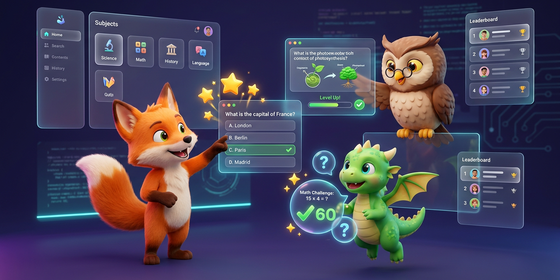

# 🎓 Quiz Buddy: Dynamic Interactive Exam Prep Companion



> Built by **Leonardo Muffato** at **AUTOSOFT Engineering** ([www.autosoft-engineering.de](https://www.autosoft-engineering.de))  
> Licensed under **Creative Commons Attribution 4.0 International (CC BY 4.0)** with upstream preservation of Google LLC's Apache 2.0 components.

---

## 🚀 Live Public Deployment
The application is fully containerized and deployed to **Google Cloud Run** with low latency, automated serverless scaling, and robust performance:
* 🌐 **Public URL:** [https://your-quiz-buddy-url.a.run.app](https://your-quiz-buddy-url.a.run.app) *(Update this placeholder with your live Cloud Run service URL after deployment)*

---

## 🎯 Project Overview
Quiz Buddy is an intelligent, highly engaging, and child-safe exam preparation application designed to help kids in Grades 5–12 master academic topics in a playful and localized environment. Powered by **Google ADK 2.0** and **Gemini 2.5 Flash**, Quiz Buddy features dynamic mascot pedagogy (Felix the Fox, Olivia the Owl, Dino the Dragon), smart curriculum checks, academic peer-review nodes, and state-of-the-art security guardrails to keep students safe.


## Project Structure

```
quiz-buddy/
├── app/         # Core agent code
│   ├── agent.py               # Main agent logic
│   └── app_utils/             # App utilities and helpers
├── tests/                     # Unit, integration, and load tests
├── GEMINI.md                  # AI-assisted development guide
└── pyproject.toml             # Project dependencies
```

> 💡 **Tip:** Use [Gemini CLI](https://github.com/google-gemini/gemini-cli) for AI-assisted development - project context is pre-configured in `GEMINI.md`.

## Requirements

Before you begin, ensure you have:
- **uv**: Python package manager (used for all dependency management in this project) - [Install](https://docs.astral.sh/uv/getting-started/installation/) ([add packages](https://docs.astral.sh/uv/concepts/dependencies/) with `uv add <package>`)
- **agents-cli**: Agents CLI - Install with `uv tool install google-agents-cli`  
  > ⚠️ **Platform Note:** The `agents-cli` tool currently only runs on **Linux** or inside **WSL (Windows Subsystem for Linux)** on Windows. Ensure your development terminal is running in a Linux/WSL environment before executing CLI commands.
- **Google Cloud SDK**: For GCP services - [Install](https://cloud.google.com/sdk/docs/install)


## Quick Start

Install `agents-cli` and its skills if not already installed:

```bash
uvx google-agents-cli setup
```

Install required packages:

```bash
agents-cli install
```

Test the agent with a local web server:

```bash
agents-cli playground
```

You can also use features from the [ADK](https://adk.dev/) CLI with `uv run adk`.

## Commands

| Command              | Description                                                                                 |
| -------------------- | ------------------------------------------------------------------------------------------- |
| `agents-cli install` | Install dependencies using uv                                                         |
| `agents-cli playground` | Launch local development environment                                                  |
| `agents-cli lint`    | Run code quality checks                                                               |
| `agents-cli eval`    | Evaluate agent behavior (generate, grade, analyze, and more — see `agents-cli eval --help`) |
| `uv run pytest tests/unit tests/integration` | Run unit and integration tests                                                        |

## 🛠️ Project Management

| Command | What It Does |
|---------|--------------|
| `agents-cli scaffold enhance` | Add CI/CD pipelines and Terraform infrastructure |
| `agents-cli infra cicd` | One-command setup of entire CI/CD pipeline + infrastructure |
| `agents-cli scaffold upgrade` | Auto-upgrade to latest version while preserving customizations |

## 🏛️ High Concurrency & Scalability Architecture

Quiz Buddy is designed from the ground up to support high-concurrency, multi-user parallel access. The technology stack scales seamlessly to accommodate thousands of simultaneous students:

### 1. Client-Side Presentation Independence
* **State Isolation:** Each user runs their own copy of the Single-Page Application (HTML/CSS/JS) entirely within their web browser. All quiz logic, timers, animations, and mascot states run locally on the client machine, resulting in zero crossover or resource contention between parallel visitors.

### 2. Async FastAPI & Session Isolation
* **Non-Blocking Async IO:** The backend is powered by **FastAPI** running on **Uvicorn**, which handles incoming HTTP requests asynchronously.
* **Isolated Sessions:** Under ADK 2.0, each user session is assigned a unique anonymous `session_id` and `user_id` (generated as UUIDs in the browser). The agent orchestrator runs separate, fully isolated instances of the quiz-generation workflow graph for each session, preventing data cross-talk.

### 3. Serverless Cloud Database (Google Cloud Firestore)
The persistence layer relies on **Cloud Firestore (Native Mode)**, Google's serverless document store built for global-scale concurrency:
* **Elastic Scaling:** Unlike traditional relational databases (which hit connection pool limits), Firestore scales automatically to handle tens of thousands of simultaneous reads and writes.
* **Atomic Satisfaction Counters (No Race Conditions):** For the **aggregated thumbs-up counter**, Firestore's native **atomic increments** are used. If 100 users complete a quiz and click "Thumbs-Up" at the exact same millisecond, Firestore guarantees they are all counted accurately without transaction deadlocks or lost updates.
* **Independent Documents:** Writing thumbs-down review logs and saving frozen quizzes create unique documents using random UUIDs, allowing parallel creations to execute at maximum cloud speed.

## 🔗 Zero-Token Frozen Quiz Sharing

Quiz Buddy includes an interactive social feature that allows students to freeze and share their generated quizzes with friends, parents, or teachers:

* **Instant Recipient Delivery:** When a user clicks **"Share"**, the frontend "freezes" the active 10-question quiz state and saves it as a static document in Google Cloud Firestore under `quizzes/{quiz_id}`.
* **Zero-Token Cost:** When a recipient visits the generated share link, our FastAPI backend (`/quiz/{quiz_id}`) serves the static SPA layout and directly loads the frozen JSON data. **No LLM model calls are triggered and zero Vertex AI tokens are consumed**, making sharing instant and infinitely scalable.
* **Serverless TTL Retention:** To limit cloud storage overhead and maintain strict compliance with GDPR/LGPD data-minimization guidelines for minors, every shared quiz is written with an `expires_at` timestamp. Firestore's native Time To Live (TTL) policy automatically deletes shared quizzes **30 days** after creation.
* **Local Offline Export:** Students can also click **"Save as HTML"** to download the complete quiz locally as a beautifully-styled, standalone HTML file that works offline without any cloud dependencies.

---

## 🛡️ Security Checkpoint & Public Repository Readiness

To allow Quiz Buddy to be safely published as a **public GitHub repository** without exposing sensitive defensive rules or safety system instructions, it implements a dynamic, serverless configuration system:

* **Dynamic Configurations:** Prompt injection keywords, administrative command regexes, defensive classification prompts, and localized block responses are stored privately in Google Cloud Firestore under the `system_config/security` document.
* **No Code Exposure:** Defensive regexes and system-level instructions are never committed to git, preventing attackers from reverse-engineering guardrail vulnerabilities.
* **Multi-Stage Interception:** The `BeforeAgentCallback` intercepts all incoming user prompts. It conducts rapid keyword and regex matching, intercepts administrative command overrides (such as requests to delete logs or modify system configurations), and runs an LLM classifier using the private prompt configuration.
* **Logged Security Events:** Malicious injection attempts or administrative bypass commands are blocked immediately and logged securely to a private `security_events` Firestore collection for auditing.

### 🤠 Automated Sheriff Guard (Zero-Token Auto-Banning)
To prevent malicious actors or automated bots from draining our Vertex AI token budget via repeated safety violations, we implement an automated defense subsystem code-named **The Sheriff Guard**:
1. **Secure Client Fingerprinting:** For every request, we extract the client's IP address and generate a one-way secure hash (`hashed_ip = SHA-256(IP + salt)`) with a secret salt stored in Firestore. Because raw IP addresses are personal data under GDPR/LGPD, this fingerprinter provides zero-PII security for minors while uniquely identifying repeat spammers.
2. **Zero-Token Fast Block:** Incoming requests are matched against a fast, local in-memory active ban list (with a 5-minute TTL). If a banned signature matches, the request is instantly short-circuited at the entry gate, consuming **exactly 0 LLM tokens** and protecting the system budget.
3. **The Gavel (3-Strike Trigger):** If a user commits a safety violation, it is logged to `security_events` under their hashed signature. The Sheriff checks their recent logs: if a signature accumulates **3 or more safety violations** within any 1-hour window, they are automatically banned for 24 hours. The ban is written to the Firestore `banned_signatures` collection and instantly updated in the local active ban cache.

> 💡 **Note:** Purely `OFF_TOPIC` requests (e.g., asking about the weather) are intercepted and redirected with a friendly response, but they are **not** treated as malicious safety violations. Only security exploits, prompt injections, or administrative override attempts are logged in `security_events` and count towards a Sheriff ban.

---

## Development

Edit your agent logic in `app/agent.py` and test with `agents-cli playground` - it auto-reloads on save.

## Deployment

```bash
gcloud config set project <your-project-id>
agents-cli deploy
```

To add CI/CD and Terraform, run `agents-cli scaffold enhance`.
To set up your production infrastructure, run `agents-cli infra cicd`.

## Observability

Built-in telemetry exports to Cloud Trace, BigQuery, and Cloud Logging.

---

## 💖 Acknowledgments & Recognition
This project was developed as a capstone project for [**Kaggle’s 5-Day AI Agents: Intensive Vibe Coding Course with Google**](https://www.kaggle.com/competitions/5-day-ai-agents-intensive-vibecoding-course-with-google) and is directly inspired by the concepts, techniques and best practices taught throughout the course.

We would like to express our deepest gratitude to the entire **Kaggle and Google team** for providing this extraordinary learning opportunity, which equipped us with the cutting-edge [**Google Agent Development Kit (ADK) 2.0**](https://adk.dev/2.0/) framework, the powerful [**agents-cli**](https://github.com/google/agents-cli) developer workflows, and the [**Antigravity CLI**](https://antigravity.google/product/antigravity-cli) coding companion, alongside the advanced evaluation pipelines and agentic methodologies necessary to bring this project to life!


