# Detailed quiz workflow

The diagram separates the surrounding **FastAPI request handling**, the
invocation-wide **ADK plugin**, and the graph-based **Workflow**. A plugin wraps
the whole invocation; it is not a workflow node. Nodes perform work, while
edges connect nodes and may select a route emitted by the preceding node. The
adaptive paths also show the Firestore-backed provenance check inside
`gather_and_route`, before curriculum preflight. A supplied server-issued ID
allows the server to load previous question texts for adaptive generation;
only trusted reinforcement may reuse the stored quiz directly. Internal
decisions are expanded for clarity, including the Judge bypass inside
`llm_as_a_judge`; they are not additional Workflow nodes.

The workflow's `validated_quizzes` records are distinct from user-created
shares. Every newly generated and approved quiz gets a best-effort, one-day
provenance record for trusted adaptive follow-ups. The `quizzes` collection is
written only when a user clicks **Share** and retains the frozen, shareable quiz
for 30 days.

```mermaid
flowchart TD
    User["Browser: structured quiz request<br/>adaptive requests include validated_quiz_id when available"] --> SSE["POST /run_sse"]

    subgraph HTTP["FastAPI request layer"]
        SSE --> Middleware["Request metadata middleware"]
        Middleware --> Context["ContextVars: client IP, anonymous ID, locale"]
        Context --> Runner["ADK App and Runner"]
    end

    subgraph Plugin["FoxQuizSecurityPlugin — wraps every invocation"]
        Runner --> Before["before_run_callback"]
        Before --> Config["Load cached private security config<br/>and hash the client IP"]
        Config --> Ban{"Active ban?"}
        Ban -- "Yes" --> BlockState["Store localized block envelope<br/>in temporary invocation state"]
        Ban -- "No" --> Budget{"User or global<br/>daily budget exceeded?"}
        Budget -- "Yes" --> BlockState
        Budget -- "No" --> LocalScan["Stage 1: local keyword<br/>and injection-regex scan"]
        LocalScan -- "Malicious match" --> Violation["Log security event<br/>and run Sheriff 3-strike check"]
        Violation --> BlockState
        LocalScan -- "No match" --> Payload{"Valid structured<br/>quiz payload?"}
        Payload -- "No" --> InvalidRequest["Fixed localized INVALID_REQUEST response<br/>no LLM call"]
        InvalidRequest --> BlockState
        Payload -- "Yes" --> Classifier["◆ LLM<br/>Stage 2: semantic security classifier"]
        Classifier --> ValidDecision{"Valid classifier decision?"}
        ValidDecision -- "No or classifier error" --> Closed["Fail closed:<br/>CLASSIFIER_UNAVAILABLE"]
        Closed --> BlockState
        ValidDecision -- "Yes" --> SafeDecision{"SAFE?"}
        SafeDecision -- "Yes" --> NoBlock["Do not set block state"]
        SafeDecision -- "No" --> OffTopicDecision{"OFF_TOPIC?"}
        OffTopicDecision -- "Yes" --> BlockState
        OffTopicDecision -- "No" --> PiiDecision{"PII?"}
        PiiDecision -- "Yes" --> PrivateBlock["Do not log the disclosed PII<br/>and do not count a Sheriff strike"]
        PrivateBlock --> BlockState
        PiiDecision -- "No (MALICIOUS)" --> Violation
    end

    subgraph Workflow["root_agent Workflow — nodes connected by routed edges"]
        Start["Workflow START"] --> Gate["security_checkpoint_node"]
        Gate -- "blocked edge" --> BlockNode["security_block_node"]
        BlockNode --> BlockSSE["Structured blocked response"]

        Gate -- "allowed edge" --> GatherEntry
        subgraph GatherFlow["gather_and_route — single Workflow node with internal flow"]
            GatherEntry["Load validated request<br/>clear client-supplied previous quiz data"] --> HasProvenance{"validated_quiz_id supplied?"}
            HasProvenance -- "No" --> Gather["◆ LLM<br/>Curriculum preflight"]
            HasProvenance -- "Yes: any request mode" --> ProvenanceRead["Firestore read<br/>validated_quizzes"]
            ProvenanceRead --> ProvenanceValid{"Record exists, unexpired,<br/>ID/context/fingerprint/contract match,<br/>and current deterministic validation passes?"}
            ProvenanceValid -- "Yes" --> PreviousSource["Load authoritative previous quiz and question texts<br/>allow direct reuse only when score ≤ 3"]
            PreviousSource --> Gather
            ProvenanceValid -- "No or read failure" --> Gather
        end
        Gather -- "ask_more edge" --> AskMore["ask_more_node<br/>terminal clarification branch"]
        Gather -- "generate_quiz edge: all modes" --> Search["decision_and_search<br/>reuse search_context when present;<br/>otherwise query relevant Wikipedia grounding"]

        subgraph QuizGeneration["quiz_generation — single Workflow node with internal flow"]
            direction TB
            GenerationEntry["Invocation entry"] --> RepairDecision{"Select candidate source<br/>or repair route"}
            RepairDecision -- "trusted reinforcement; no pending repair" --> ReuseQuiz["Reuse stored public quiz<br/>shuffle questions and options;<br/>track known index; set Easy difficulty"]
            RepairDecision -- "local academic issues or duplicate-only defects" --> TargetedRepair["◆ LLM<br/>Shared targeted repair executor<br/>repair complete affected questions;<br/>return internal correct_answer"]
            RepairDecision -- "initial or full regeneration" --> FullGeneration["◆ LLM<br/>Generate complete quiz<br/>return internal correct_answer"]
            TargetedRepair --> NormalizeAffected["Common normalization for affected questions<br/>match answer; shuffle options; derive index;<br/>remove correct_answer; assemble with unaffected questions"]
            FullGeneration --> NormalizeQuiz["Common normalization boundary<br/>canonicalize correct_answer; shuffle options;<br/>derive public index; remove internal field"]
            NormalizeAffected --> CandidateReady["Candidate ready"]
            NormalizeQuiz --> CandidateReady
            ReuseQuiz --> CandidateReady
        end

        Search --> GenerationEntry
        CandidateReady --> Validate["deterministic_quiz_validation<br/>public structure, duplicate options,<br/>index bounds, emoji, and answer-cue checks"]
        Validate -- "valid edge" --> JudgeGate{"Trusted reinforcement<br/>reuse?"}
        JudgeGate -- "Yes" --> QuizOutput["quiz_output_node<br/>final invariant and validated quiz"]
        JudgeGate -- "No" --> Judge["◆ LLM<br/>llm_as_a_judge<br/>semantic and factual review"]
        Validate -- "retry edge: structural repair budget" --> GenerationEntry
        Validate -- "quality_failure edge" --> QualityFailure["quality_failure_node<br/>safe retry message and diagnostic"]
        Judge -- "success edge" --> QuizOutput
        Judge -- "Rejected" --> AcademicBudget{"Academic repair<br/>unused?"}
        AcademicBudget -- "No" --> QualityFailure
        AcademicBudget -- "Yes" --> AcademicStrategy{"All issues local<br/>with usable indices?"}
        AcademicStrategy -- "Yes: targeted" --> GenerationEntry
        AcademicStrategy -- "No: full regeneration" --> GenerationEntry
        Judge -- "quality_failure edge" --> QualityFailure
    end
    NoBlock --> Start
    BlockState --> Start

    Gather -. "clarification SSE content" .-> FrontendSetup["Frontend setup screen"]

    BlockSSE -. "SSE content" .-> FrontendBlock["Frontend block screen"]
    QuizOutput --> ProvenanceWrite["Best-effort Firestore write/reuse<br/>validated_quizzes; return validated_quiz_id"]
    ProvenanceWrite -- "success or write failure" --> FrontendQuiz["Frontend quiz wizard<br/>public quiz only; no correct_answer"]
    FrontendQuiz -. "adaptive request with validated_quiz_id" .-> SSE
    QualityFailure -. "SSE content" .-> FrontendSetup

    BlockSSE --> After["after_run_callback"]
    AskMore --> After
    QuizOutput --> After
    QualityFailure --> After
    After --> Tokens["Flush accumulated token usage<br/>to Firestore budgets"]

    Runner -. "unexpected exception" .-> RunError["on_run_error_callback"]
    RunError --> Tokens

    classDef bestCase fill:#E6F4EA,stroke:#137333,color:#0D3B1E,stroke-width:3px
    classDef llmCall stroke:#ffb03a,stroke-width:4px
    class User,SSE,Middleware,Context,Runner bestCase
    class Before,Config,Ban,Budget,LocalScan,Payload,Classifier,ValidDecision,SafeDecision,NoBlock bestCase
    class Start,Gate,GatherEntry,HasProvenance,Gather,Search bestCase
    class GenerationEntry,RepairDecision,FullGeneration,NormalizeQuiz,CandidateReady bestCase
    class Validate,JudgeGate,Judge,QuizOutput,ProvenanceWrite,FrontendQuiz bestCase
    class Classifier,Gather,TargetedRepair,FullGeneration,Judge llmCall
```

**Diagram legend**

- **Green blocks** mark the best-case quiz path: the request passes every
  security and budget check, the initial candidate has no duplicate or other
  deterministic defect, the academic Judge accepts it, and the browser opens
  the frontend quiz wizard without a retry.
- **Default-colored blocks** are used only by alternative clarification,
  blocking, targeted-repair, quality-failure, or error paths. Retry paths can
  re-enter green generation blocks; green means the block is traversed in the
  best case, not that it is exclusive to that path.
- **Gold-orange border and `◆ LLM` stamp** mark a block that performs one or
  more LLM calls. These calls currently use `gemini-2.5-flash`. A green block
  with a gold-orange border is both part of the best-case path and an
  LLM-calling block.
