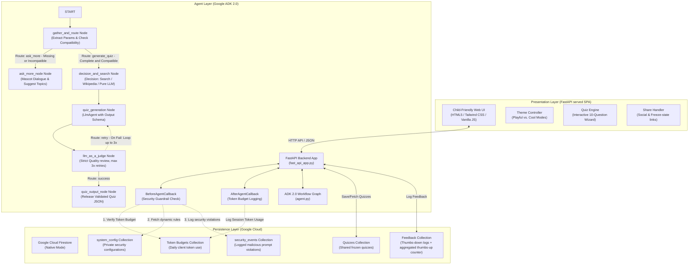

# Implementation Plan: Quiz Buddy (Prüfungsvorbereitung für Schüler)

We have completed the `/grill-me` alignment interview! Based on your selections and requirements, here is the finalized architecture and step-by-step implementation blueprint.

---

## 🏛️ System Architecture

---

## 🛠️ Design Decisions Summary

| Dimension | Selected Design | Details |
| :--- | :--- | :--- |
| **Database** | **Google Cloud Firestore (Native Mode)** | Fully serverless document store to house daily token budgets (by client anonymous ID), feedback logs (thumbs-down log and atomic thumbs-up count), frozen shared quizzes, dynamic security configurations (`system_config`), and logged security violations (`security_events`). |
| **Curriculum Source** | **Autonomous Curriculum Search Skill** | The agent dynamically decides if external search/Wikipedia grounding is needed, then aligns the quiz with Germany, Brazil, or USA's school curriculum standards using its internal LLM knowledge. |
| **Quiz Structure** | **Entire Quiz JSON Generated at Once** | The ADK Agent outputs a complete structured JSON containing all 10 questions, choices, explanations, and answers. The frontend handles the step-by-step interactive navigation, keeping the API super clean. |
| **Guardrails & Budgets** | **Callback Hooks (`Before` / `After`)** | Security Checkpoint runs inside `BeforeAgentCallback`. Token budget tracking and Firestore logging run inside `AfterAgentCallback`. |
| **Web Frontend** | **FastAPI-Served Premium SPA** | A stunning, responsive Single-Page Application served directly by our FastAPI app. It features modern Rounded layouts, Glassmorphism, animations, and active mascots (*Felix*, *Olivia*, *Dino*). Run everything with one command! |
| **Progress Feedback** | **Asymptotic Outer Circle Loader** | Replaced standard spinners with a dynamic, non-rotating central mascot, infinitely spinning outer dash spinner, and a visual SVG overlay filled progressively via an asymptotic formula (fast start, slowing down near 98%). Complete snap to 100% on successful quiz render. |
| **User Feedback (Rating)** | **Anti-Spam Localized Thumbs UP/Down** | Tracks and allows exactly 1 rating per quiz run by disabling further clicks (`pointer-events: none`). Dynamically localizes toast messages into EN/DE/PT, including a tailored message for negative ratings (`Thumbs Down`) committing to continuously improve the app based on their feedback. |
| **Internationalization** | **Dynamic Lookup, No Static Strings** | All UI translations and user-facing messages must be loaded dynamically from localized translation dictionaries (DE/PT/EN). This includes dynamic, language-specific labels prepended before difficulty indicators (e.g. "Level: Medium", "Nível: Médio", "Stufe: Mittel"). Hardcoded static strings are prohibited to maintain a fully synchronized multilingual user experience. |

---

## 📅 Implementation Roadmap

### Phase 1: Database Setup & Callbacks (Backend Foundation)
- [x] Install `google-cloud-firestore` dependency.
- [x] Implement Firestore repository classes with explicit schema mappings for:
  - **Shared Quizzes**: Storing and retrieving frozen JSON quiz objects at path `quizzes/{quiz_id}`. Each document includes an `expires_at` timestamp (default: 30 days from creation) enabling Firestore's native Time To Live (TTL) policy to auto-delete expired quizzes, reducing storage costs and complying with GDPR data minimization guidelines.
  - **Token Budgets**: Managing daily reading/writing of token counters at paths `budgets/{anonymous_id}` and `budgets/global`.
  - **Feedback Logs**: Storing detailed logs of thumbs-down responses under `feedback_logs/{log_id}` and atomically incrementing the global positive feedback count at `feedback_metrics/satisfaction`.
  - **Dynamic Security Configuration**: Fetching dynamic parameters from the private configuration document `system_config/security`. Document schema must map to:
    * `classification_prompt` (string): Private system instructions for the lightweight LLM safety classifier.
    * `blocklist_keywords` (array of strings): High-priority terms to catch via local scanning.
    * `injection_regexes` (array of strings): Compiled regex expressions for injection patterns.
    * `responses` (map of localized strings): Friendly block messages per language (e.g. `injection_de`, `off_topic_de`).
  - **Security Events**: Writing audit records to the private collection `security_events/{event_id}` upon violation:
    * `anonymous_id` (string): The anonymous visitor session identifier.
    * `hashed_ip` (string): The secure SHA-256 fingerprint of the user's IP (used by the Sheriff).
    * `blocked_input` (string): The raw blocked user prompt (completely isolated from the main LLM pipelines).
    * `timestamp` (timestamp): Precise timestamp of the violation.
    * `violation_type` (string): The classification category (e.g., `RegexMatch`, `KeywordMatch`, `ClassifierBlock`).
  - **Banned Signatures**: Managing active bans under the path `banned_signatures/{hash_id}`. Document schema must map to:
    * `hashed_ip` (string): The secure SHA-256 fingerprint of the banned IP.
    * `banned_at` (timestamp): The timestamp when the ban was issued.
    * `expires_at` (timestamp): The timestamp when the ban expires (default: 24 hours).
- [x] Implement `BeforeAgentCallback` to perform the dynamic **Security Checkpoint**, **Sheriff Guard checks**, and **Token Budget Verification**:
  - Lazily load and cache the `system_config/security` document in memory with a short TTL (e.g. 5 minutes) to protect against DB query latency.
  - **Secure Hashed Fingerprinting**: Extract the incoming request IP and run a one-way secure hash (`hashed_ip = SHA-256(IP + salt)`) to fingerprint clients anonymously.
  - **Zero-Token Fast Block**: Intercept requests immediately and check against a fast, locally cached list of active banned signatures. If matching, reject the request instantly with a friendly block warning (**0-token cost**).
  - Apply multi-stage validation on unbanned prompts: first run fast local keyword/regex scans, then secondary LLM guardrail classification using the dynamic system prompt.
  - If a prompt is malicious (e.g. administrative command override or database deletion attempt):
    * Block execution and return a localized friendly safety error.
    * Log the violation to `security_events`, tagged with the user's `hashed_ip`.
    * **Automated Sheriff Trigger**: Query the count of safety violations logged for this `hashed_ip` in the last hour. If the count reaches **3**, write a ban document to `banned_signatures` and add the signature to the local active ban cache for the next 24 hours.
  - Verify that the daily token budgets (both user-level and global) are within bounds before allowing the session to invoke the LLM.
- [x] Implement `AfterAgentCallback` for **Token Budget Accumulation** (extracting raw ADK session token usage and incrementing the client/global Firestore counters).

### Phase 2: Core ADK 2.0 Workflow Graph (Agent Logic)
- [x] Define robust Pydantic models for the Quiz format:
  - `QuizQuestion`: Question text, 3–5 options, index of the correct option, explanation.
  - `Quiz`: Array of 10 `QuizQuestion`s.
- [x] Implement the **Workflow Graph** in `app/agent.py`:
  - **Knowledge Gathering Node**: Dynamically decides whether to use internal LLM knowledge or execute the "Curriculum Search Skill" (web search or Wikipedia tools).
  - **Quiz Generation Node**: `LlmAgent` with `Quiz` output schema.
  - **LLM-as-a-Judge Node**: Evaluates the generated quiz. If checks fail, loops back to the generator (up to 5 iterations).
- [ ] Implement **Upfront Curriculum Validation & Mascot Age-Appropriateness Guidance**:
  - Define `CurriculumCompatibility` Pydantic model for structured safety evaluation (compatibility status, pedagogical rationale, and 2-3 alternative topics suitable for that grade).
  - Insert a fast `gemini-2.5-flash` check with `temperature=0.0` in `gather_and_route` once the user submits grade, subject, and topic.
  - If incompatible: Clear the topic from state, generate a helpful, encouraging mascot message explaining the grade mismatch in the user's preferred language, offer 2-3 age-appropriate topic alternatives, and return a `route="ask_more"` event.
  - If compatible: Transition seamlessly with `route="generate_quiz"`.
  - Cap maximum retry loops in `llm_as_a_judge` to 3 iterations for additional latency security.

### Phase 3: Premium Single-Page Application (Frontend)
- [x] Create `app/static/` and write a highly polished `index.html` featuring:
  - Google Fonts (`Baloo 2` and `Nunito`).
  - Playful vs. Cool theme toggles.
  - Geolocation detection & Language flag dropdown (Deutsch / Português / English).
  - Clean animated quiz navigation cards (glassmorphic styling, progress bars).
  - Interactive mascots (*Felix der Fuchs*, *Olivia die Eule*, *Dino der Drache*).
  - Local HTML Export & "Share Link" creation.
  - **Asymptotic Progress Circle Overlay**: A non-rotating central mascot, infinitely spinning outer dash spinner, and an SVG progress ring driven by a smooth mathematical progression during long LLM-generating states.
  - **Anti-Spam & Localized User Feedback**: Locks rating buttons after 1 click via `pointer-events: none` and state tracking. Toasts are fully translated (DE/EN/PT) with a constructive continuous-improvement notice for Thumbs Down.
  - **Dynamic Translations Only**: All user-facing text, alerts, correctness/incorrectness messages, exports, difficulty levels (with dynamic language-specific prefixes such as "Level: ", "Nível: ", "Stufe: "), and footer labels must be driven dynamically via i18n lookup structures (no hardcoded/static UI text in general markup).
  - **Interactive Difficulty Hover Tooltips**: Display clean popover tooltips above `#quiz-difficulty` and `#summary-difficulty` on mouse hover, explaining how the difficulty levels scale (🌱 Easy for score < 5, ⭐ Medium for score 5-9, 🚀 Hard for perfect 10/10). The explanations are dynamic and fully localized via `tooltip_easy`, `tooltip_medium`, and `tooltip_hard` keys.
- [x] Update `app/fast_api_app.py` to serve the static frontend, handle custom routes (`/feedback`, `/quiz/{quiz_id}`, `/share`), and mount the ADK app.

---

> [!TIP]
> This structure ensures maximum performance and a beautiful visual presentation while remaining 100% compliant with standard ADK 2.0 practices.
